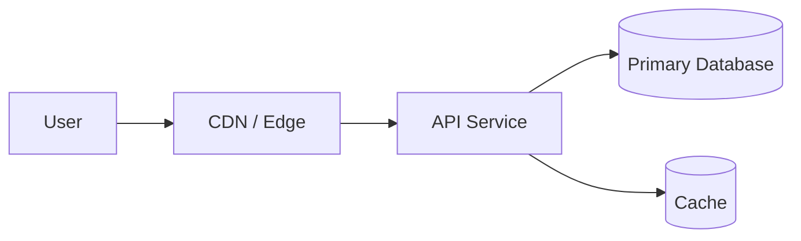

# System Designer Claude Build Guide

This file tells Claude how to build and evolve **System Designer**.

System Designer is a Gradle/JVM application that turns a user's short system-design prompt into an end-to-end system design answer. The output should follow the practical interview style recommended by Hello Interview: start with the simplest useful design, explain assumptions in plain English, show diagrams, then go deep on the parts that matter.

The product should be usable as an installable CLI binary and should also provide a local GUI for reading, exploring, and exporting the generated design.

## Product Goal

Build a tool that accepts a command like:

```bash
system-designer "Design over-the-air updates for a React Native app"
```

and produces a complete system design package:

- A clear high-level answer.
- One or more architecture diagrams.
- Deep dives into the important subsystems.
- API contracts and data models where applicable.
- Failure modes and recovery behavior.
- Scaling and operational tradeoffs.
- Plain-English explanations that assume the reader does not already know the domain.
- Visual references when they help the user understand the design.

The tool should be especially good at producing interview-ready answers: structured, concrete, defensible, and easy to talk through.

## Non-Negotiable Principles

1. Assume no pre-existing knowledge.
   Define important terms the first time they appear. If a design mentions a CDN, queue, cache, shard, load balancer, consensus system, or native mobile boundary, explain what it is and why it exists.

2. Start simple, then layer complexity.
   The answer should begin with the smallest correct design and then add scale, resilience, performance, security, and operational detail.

3. Prefer concrete systems over generic prose.
   Name example components, request shapes, response shapes, storage choices, rollout behavior, and failure handling. Avoid vague phrases like "use a service" unless the service is defined.

4. Show the system visually.
   Every full answer should include at least one high-level architecture diagram. Add sequence diagrams, data flow diagrams, storage diagrams, or UI mock references when they clarify the explanation.

5. Match the Hello Interview answer shape.
   Answers should feel like a strong system design interview response: requirements, scale, APIs, data model, high-level architecture, deep dives, bottlenecks, tradeoffs, and wrap-up.

6. Build with testable boundaries.
   Keep CLI parsing, prompt orchestration, Claude integration, design modeling, rendering, GUI state, and export behavior separated.

## Expected User Experience

The CLI should support at least:

```bash
system-designer "Design a URL shortener"
system-designer --format markdown "Design a chat app"
system-designer --format html --output ./design.html "Design a news feed"
system-designer --gui "Design a payment system"
```

The GUI should let the user:

- Enter or revise the design prompt.
- See the high-level architecture first.
- Expand deep-dive sections.
- View diagrams inline.
- Copy or export the answer.
- Re-run generation after changing assumptions.
- Inspect the raw structured design model for debugging.

The CLI must remain useful without the GUI. The GUI is a richer viewer and editor, not the only way to use the product.

## Claude Integration

System Designer should communicate with the Claude installation available on the local machine.

Treat Claude as a replaceable adapter, not as logic scattered throughout the app. The app should have a `ClaudeClient` or equivalent interface responsible for:

- Discovering whether Claude is available.
- Sending the system-design prompt.
- Passing a strict generation instruction template.
- Receiving model output.
- Reporting useful errors when Claude is missing, times out, or returns malformed output.

Prefer a structured response contract between the app and Claude. If Claude returns Markdown, parse it into a structured internal model before rendering. If Claude can return JSON reliably, prefer JSON plus validation.

The rest of the app should depend on a domain-level interface such as `DesignGenerator`, not directly on shell commands or Claude-specific APIs.

## Recommended Architecture

Use a Kotlin/JVM Gradle project with these core areas:

```text
src/main/kotlin/com/phundal/system/designer/
  cli/
    CommandLineApp.kt
    CliOptions.kt
  generation/
    DesignGenerator.kt
    PromptTemplate.kt
    ClaudeDesignGenerator.kt
  claude/
    ClaudeClient.kt
    LocalClaudeClient.kt
    ClaudeDiscovery.kt
  model/
    SystemDesign.kt
    DesignSection.kt
    Diagram.kt
    Tradeoff.kt
    ApiContract.kt
    DataModel.kt
    FailureMode.kt
  render/
    MarkdownRenderer.kt
    HtmlRenderer.kt
    MermaidRenderer.kt
  gui/
    SystemDesignerWindow.kt
    DesignViewModel.kt
  export/
    FileExporter.kt
```

Suggested responsibility boundaries:

- `cli`: Parse arguments, invoke generation, render output, write files, set exit codes.
- `generation`: Own the prompt template and convert user intent into a structured design.
- `claude`: Handle all local Claude process or API communication.
- `model`: Represent the design answer independent of Markdown, HTML, or GUI concerns.
- `render`: Convert the model into Markdown, HTML, Mermaid, or GUI-friendly display data.
- `gui`: Display and explore generated designs.
- `export`: Save generated output to disk.

Keep these boundaries strict. For example, the GUI should not know how to call Claude, and the Claude adapter should not know how to render HTML.

## System Design Answer Format

Generated answers should use this default structure.

### 0. The One Concept Everything Hangs On

Open with the single core idea the design depends on. This should be written in plain English.

Example:

> A URL shortener is mostly a mapping system: it takes a long URL, stores it under a short code, and redirects users from the short code back to the original URL.

### 1. Requirements and Scope

Separate functional and non-functional requirements.

Include:

- What users can do.
- What the system must guarantee.
- What is explicitly out of scope.
- Any assumptions being made.

### 2. Scale and Constraints

Estimate enough scale to make design choices meaningful.

Include:

- Read/write ratio.
- Request rate.
- Storage growth.
- Latency expectations.
- Availability expectations.
- Geographic concerns when applicable.

Do not overdo math. Use estimates to justify design decisions.

### 3. API Contract

Define the main client/server or component contracts.

Use concrete examples:

```http
POST /v1/short-links
Content-Type: application/json

{
  "longUrl": "https://example.com/articles/system-design",
  "customAlias": null
}
```

```json
{
  "shortUrl": "https://sho.rt/aB92x",
  "expiresAt": null
}
```

Explain the most important fields and compatibility rules.

### 4. Data Model

Show the main entities and indexes.

For each entity, explain:

- What it represents.
- Why it exists.
- Important fields.
- Primary lookup patterns.
- Retention or lifecycle behavior.

### 5. High-Level Architecture

Include a diagram before the prose when possible.

Use Mermaid as the first diagram format because it renders well in Markdown:



Then explain the request flow in numbered steps.

### 6. Deep Dives

Pick the most important subsystems for the prompt. Do not deep-dive every component equally.

Common deep dives:

- ID generation.
- Caching strategy.
- Database partitioning.
- Consistency model.
- Queueing and async workers.
- Search or ranking.
- Realtime delivery.
- Authorization.
- Observability.
- Rollout or migration strategy.
- Client-side behavior.

Each deep dive should answer:

- What problem is this solving?
- What is the simplest version?
- What breaks at scale?
- What design do we choose?
- What tradeoff are we accepting?

### 7. Failure Modes

Handle failures explicitly.

Use a table when useful:

```text
Failure                         Behavior
Database unavailable             Return cached reads, fail writes safely, alert operators
Cache miss or cache outage        Fall back to database
Worker crashes                    Message remains in queue and is retried
Malformed client request          Return a clear 4xx error
```

The answer should explain why failures do not corrupt data or permanently break the user experience.

### 8. Tradeoffs

Tradeoffs are the heart of the answer. Name the decision, the cost, and what was bought.

Example:

```text
Decision                         Cost                         Benefit
Cache popular redirects          Stale entries possible        Lower latency and database load
Generate random short codes       Collision handling needed     Simple distributed writes
Use async analytics pipeline      Delayed metrics               Redirect path stays fast
```

### 9. Visual References

When applicable, include or generate references such as:

- Architecture diagrams.
- Sequence diagrams.
- State diagrams.
- UI layout references.
- Timeline diagrams.
- Storage relationship diagrams.

Prefer actual rendered diagrams over describing that a diagram should exist.

### 10. Glossary

End with a glossary for every important term used in the answer.

This is required because the tool should assume the user does not already know the domain.

## Prompt Template Requirements

The generation prompt sent to Claude should instruct it to:

- Answer the user's exact prompt.
- Ask no follow-up questions unless the prompt is impossible to answer.
- State assumptions directly.
- Use the full answer format above.
- Include at least one Mermaid diagram.
- Include a high-level section and deep-dive sections.
- Define jargon in plain English.
- Provide concrete APIs and data models when applicable.
- Include failure modes and tradeoffs.
- Include visual references where helpful.
- Return output in the requested structured format.

The prompt template should include the OTA update example style as a reference pattern: line up the hidden subquestions, answer them in order, start simple, and layer the difficult parts afterward.

Do not hardcode only mobile examples. The system must handle broad system design prompts.

## Output Model

Represent generated designs with a structured model similar to:

```kotlin
data class SystemDesign(
    val title: String,
    val prompt: String,
    val assumptions: List<String>,
    val coreConcept: String,
    val requirements: Requirements,
    val scale: ScaleEstimate?,
    val apiContracts: List<ApiContract>,
    val dataModels: List<DataModel>,
    val diagrams: List<Diagram>,
    val highLevelArchitecture: DesignSection,
    val deepDives: List<DesignSection>,
    val failureModes: List<FailureMode>,
    val tradeoffs: List<Tradeoff>,
    val glossary: List<GlossaryEntry>
)
```

This does not need to be the exact final code, but the implementation should preserve this idea: generation creates a structured design, and renderers display it.

## CLI Packaging

The project should build an installable command-line binary.

Use Gradle's `application` plugin or a packaging tool appropriate for Kotlin/JVM. The desired end state:

```bash
./gradlew installDist
./build/install/SystemDesigner/bin/system-designer "Design a rate limiter"
```

The installed command should:

- Return exit code `0` on success.
- Return non-zero exit codes for missing prompt, Claude unavailable, generation failure, validation failure, or file write failure.
- Print helpful error messages.
- Support `--help`.

## GUI Direction

Build the GUI after the CLI and model are stable.

The GUI should be local-first and should reuse the same generation and rendering pipeline as the CLI. Avoid building a separate GUI-only path.

Acceptable JVM GUI choices include Compose Multiplatform for Desktop, JavaFX, or another Gradle-friendly JVM UI stack. Choose one deliberately and document why.

The first useful GUI should have:

- Prompt input.
- Generate button.
- Loading and error states.
- Rendered design output.
- Diagram rendering or at least Mermaid source preview.
- Export controls.

Do not build a marketing landing page. Build the actual working design tool.

## Testing Strategy

Add tests around boundaries that can break independently:

- CLI option parsing.
- Prompt template construction.
- Claude discovery and error mapping.
- Parsing Claude output into the design model.
- Markdown rendering.
- HTML rendering.
- Export file behavior.
- Golden-file tests for representative generated designs.

Use fake Claude clients in tests. Do not require live Claude calls for normal unit tests.

Add at least one end-to-end smoke test that runs the app with a fake generator and verifies the output contains the expected sections.

## Milestones

### Milestone 1: CLI Skeleton

- Add Gradle `application` setup.
- Create a `system-designer` command.
- Parse prompt and output options.
- Return a placeholder structured design.
- Render Markdown to stdout.

### Milestone 2: Structured Design Model

- Add model classes.
- Add Markdown renderer.
- Add sample generated designs as fixtures.
- Add tests for rendering and required sections.

### Milestone 3: Claude Adapter

- Discover local Claude.
- Send the generation prompt.
- Capture output.
- Map errors clearly.
- Add fake-client tests.

### Milestone 4: Diagrams and Visual Output

- Require Mermaid diagrams in generated output.
- Render diagrams as Markdown Mermaid blocks.
- Add HTML export.
- Add visual-reference sections where useful.

### Milestone 5: GUI

- Choose JVM GUI framework.
- Build prompt input and output viewer.
- Reuse CLI generation pipeline.
- Add export actions.

### Milestone 6: Installable Tool

- Build install distribution.
- Verify command works from the generated binary path.
- Document install and usage.

## Development Rules for Claude

When working on this project:

- Read this file before making product or architecture changes.
- Keep implementation steps small and testable.
- Do not skip the CLI while building the GUI.
- Do not couple rendering to Claude calls.
- Do not store the design only as a Markdown string.
- Do not assume every prompt is web backend architecture; support mobile, desktop, infrastructure, data, realtime, and AI systems.
- Prefer explicit examples over abstract advice.
- Update this guide if the product direction changes.

## Definition of Done

A feature is done when:

- It works from the CLI.
- It is covered by focused tests or a documented manual verification.
- It keeps the structured design model intact.
- It produces output that includes both high-level explanation and deep dives.
- It includes diagrams or diagram source when the answer calls for architecture.
- Error messages are useful to a user who is not familiar with the internals.

